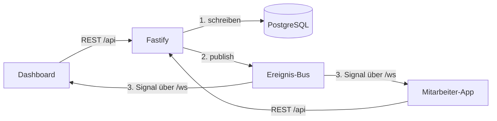

# LagerHub

**Echtzeit-Aufgabenverwaltung für Lagerteams.** Ein Manager-Dashboard verteilt
Arbeit, die Mitarbeiter übernehmen sie am Handy. Was im Lager passiert, ist
ohne Neuladen sofort auf allen Geräten sichtbar.

LagerHub bildet die tatsächlichen Abläufe eines Lagers ab und ist für den
Einsatz auf einem Windows Server im Firmennetz ausgelegt.

---

## Was es kann

**Manager-Dashboard** (Browser)
- Aufgaben aus Arbeitsschritten aufbauen: Reihenfolge, Vorgänger, benötigte
  Fähigkeit, Einzel- oder Team-Schritt mit Mindest- und Höchstbesetzung
- Live-Übersicht: was läuft, was wartet, wer arbeitet gerade woran, und ein
  Auslastungstacho für Personal und Engpässe
- Mitarbeiter gezielt einsetzen (Angebot, das am Handy angenommen oder
  abgelehnt wird)
- Tagesjournal und Historie mit Netto-Arbeitszeiten je Person und Schritt
- Auswertungen mit Diagrammen und Excel-Export
- Wiederkehrende Erinnerungen (Wartung, Prüfung, Bestellung), die per Klick
  zur Pool-Aufgabe werden
- Rollen: Admin, Manager, Büro, jeweils mit eigenem Funktionsumfang

**Mitarbeiter-App** (Progressive Web App, am Handy installierbar)
- Zeigt nur die Schritte, für die der Mitarbeiter qualifiziert ist
- Einloggen, Unterbrechen, Fortsetzen, Abschließen, wahlweise mit
  Pflichtangabe (z. B. „Anzahl Paletten“)
- Push-Benachrichtigungen bei dringenden Aufgaben und bei Eskalation
- PIN-Anmeldung mit Gerätebindung

**Im Hintergrund**
- Eskalation, wenn eine hoch priorisierte Aufgabe zu lange liegt (mit
  einstellbarer Pause, in der nicht gemeldet wird)
- Anbindung an die Zeiterfassung Crewmeister: Ausstempeln unterbricht die
  laufende Arbeit automatisch, damit keine Nacht als Arbeitszeit gebucht wird

---

## Technik

| Bereich | Technologie |
|---|---|
| Backend | Node.js 24, Fastify 5, TypeScript, zod |
| Datenbank | PostgreSQL 17, Prisma 7 (Driver Adapter) |
| Echtzeit | WebSocket (`@fastify/websocket`) |
| Auth | JWT mit rollenbasierten Guards je Route, Login-Rate-Limit |
| Dashboard | React 19, Vite 8, TanStack Query, Recharts, SheetJS |
| Mitarbeiter-App | React 19, Vite 8, `vite-plugin-pwa`, eigener Service Worker |
| Push | Web Push mit VAPID |
| Tests | Vitest, 156 Tests, teils gegen eine echte PostgreSQL |
| Betrieb | IIS als Reverse Proxy mit TLS, Backend als Windows-Dienst |

### Architektur



**Die Datenbank ist die einzige Quelle der Wahrheit.** Jede Änderung wird
zuerst in PostgreSQL geschrieben, erst danach geht ein Ereignis an die
verbundenen Clients. Dieses Ereignis enthält keine Daten, es ist nur ein
Signal: Die Clients verwerfen daraufhin ihren Cache und laden über REST neu.
Fällt eine Zustellung aus, fehlt also höchstens ein Live-Update, nie ein
Datensatz.

---

## Technische Schwerpunkte

**Gleichzeitige Zugriffe.** Tippen fünf Mitarbeiter im selben Moment auf einen
Schritt mit einem freien Platz, darf genau einer ihn bekommen. Prüfen und
Belegen laufen deshalb atomar unter einer PostgreSQL-Zeilensperre
(`SELECT … FOR UPDATE`). Abgesichert ist das durch Tests gegen eine echte
Datenbank, denn Sperren lassen sich nicht mocken. Gegenprobe: Mit
ausgeschalteter Sperre landen 5 von 8 Anfragen in einem Schritt mit 3 Plätzen,
und die Tests werden rot.

**Abgeleiteter statt gespeicherter Status.** Ob ein Schritt gesperrt, offen,
wartend, aktiv, unterbrochen oder erledigt ist, wird nie gespeichert, sondern
jedes Mal aus Zuweisungen und Vorgängern berechnet. Die Ableitung ist eine
reine Funktion ohne Datenbankzugriff und deshalb vollständig testbar.

**Netto-Arbeitszeit.** Unterbrechungen werden je Zuweisung aufsummiert;
Arbeitszeit ist Ende minus Start minus Unterbrechungen. Team-Zeit wird im
Journal nur einmal gezählt, Wartezeit vor dem Teamstart nicht mitgerechnet.

**Abfragen ohne N+1.** Die Hauptansicht lädt Anzeige- und Statusdaten in einer
einzigen Abfrage per JOIN und berechnet den Status im Speicher, statt pro
Schritt nachzufragen.

**Sicherheit.** Jede API-Route hat einen Rollen-Guard. Die Identität kommt
immer aus dem signierten Token, nie aus dem Request-Body. Das Backend lauscht
nur auf `localhost`, nach außen spricht ausschließlich der Reverse Proxy über
HTTPS.

**Betrieb hinter einem Proxy.** Der WebSocket sendet alle 20 Sekunden ein
Lebenszeichen, damit der Proxy die Verbindung nicht wegen Leerlaufs trennt.
Nach einem Abriss laden die Clients automatisch nach, damit keine Änderung
verloren geht.

---

## Projektstruktur

```
backend/    Fastify-API, Prisma-Schema und Migrationen, Scheduler, Tests
frontend/   Manager-Dashboard (React)
pwa/        Mitarbeiter-App (React, PWA)
docs/       Übergabe- und Installationsdokumentation für die IT
```

Eine ausführliche technische Beschreibung mit allen Geschäftsregeln und
Designentscheidungen steht in [`CLAUDE.md`](CLAUDE.md).

---

## Lokal starten

Voraussetzungen: Node.js 24, PostgreSQL 17, Windows mit PowerShell (für das
Startskript und die lokalen HTTPS-Zertifikate; OpenSSL wird benötigt).

```powershell
# 1. Abhängigkeiten installieren
cd backend;  npm install; cd ..
cd frontend; npm install; cd ..
cd pwa;      npm install; cd ..

# 2. In PostgreSQL eine Datenbank samt Benutzer anlegen, dann die
#    Konfiguration kopieren und ausfüllen
#    (DATABASE_URL, JWT_SECRET, ADMIN_PINS, optional VAPID-Schlüssel für Push)
copy backend\.env.example backend\.env

# 3. Datenbankschema einspielen
cd backend; npm run migrate:deploy; cd ..

# 4. Alles starten (erzeugt beim ersten Mal ein lokales HTTPS-Zertifikat)
.\start.ps1
```

Danach laufen das Dashboard unter `https://localhost:5173` und die
Mitarbeiter-App unter `https://localhost:5174`. Die erste Anmeldung am
Dashboard erfolgt mit einer der Admin-PINs aus der `.env`.

Tests: `cd backend; npm test`. Die Tests gegen die echte Datenbank brauchen
einmalig `npm run db:test:setup` und überspringen sich sonst selbst.
